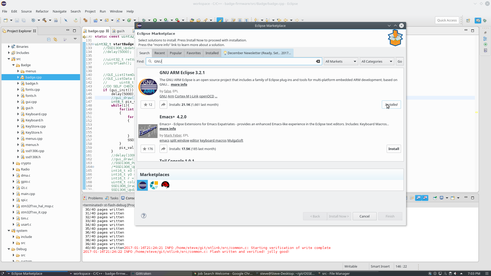
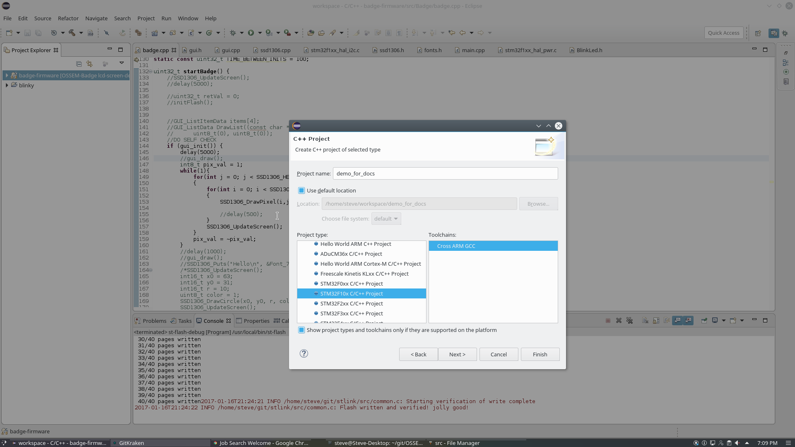
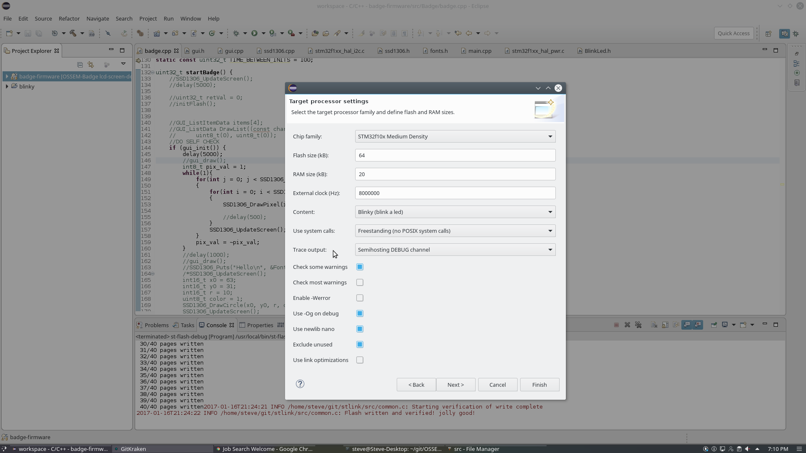
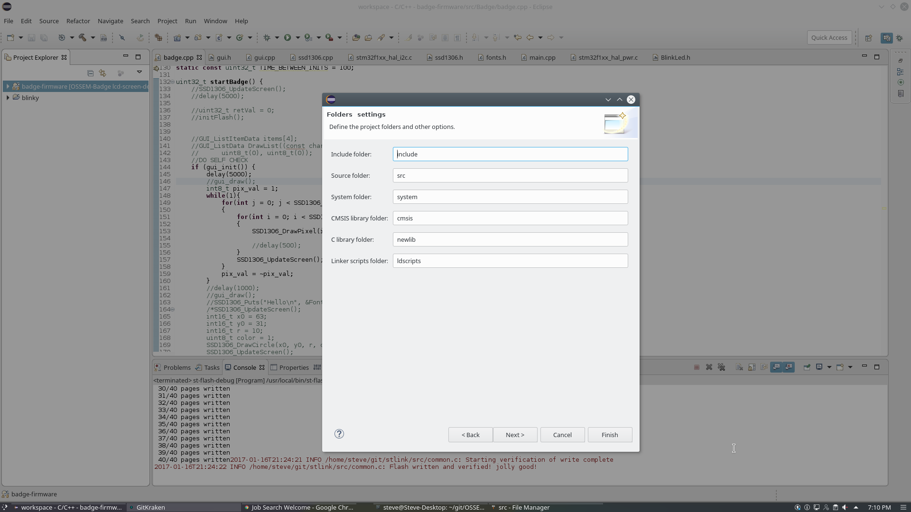
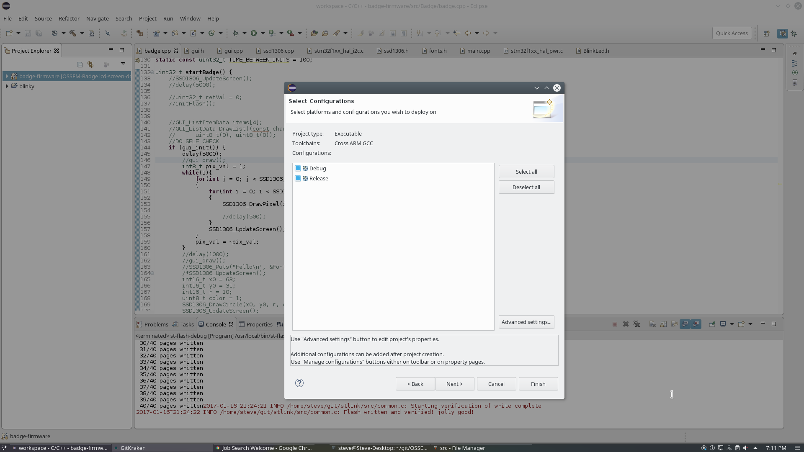
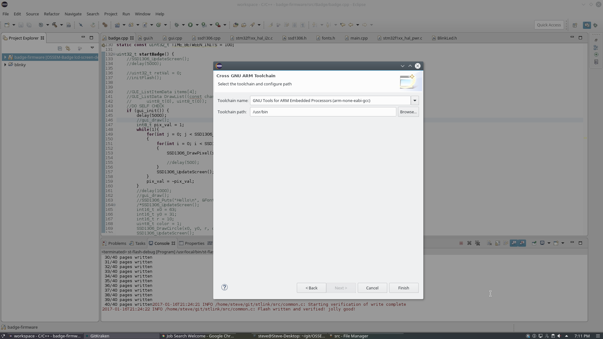
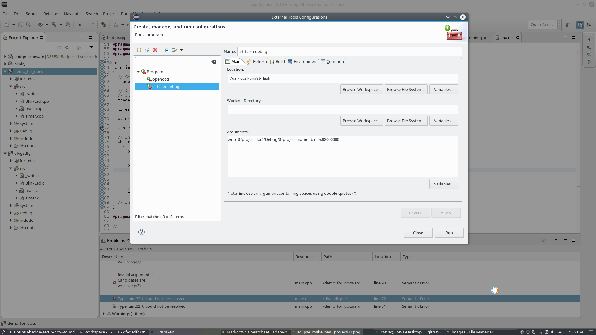
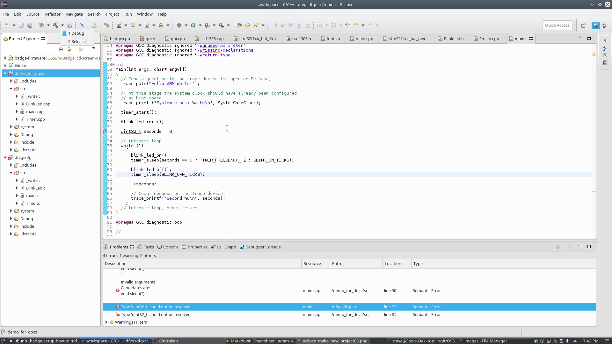

## Setup Eclipse Neon IDE
Start Eclipse by going to you eclipse install directory and running the eclipse
executable. Choose your workspace to be ~/workspace. **WARNING** Eclipse does
not do tilde exapansion so type out your full path to your workspace (for
example /home/you\_username/workspace). Once Eclipse is loaded up go to Help >
Eclipse Marketplace... In the find search bar we are going to type GNU. We need
to install GNU ARM Eclipse 3.1.1. This will install the necessary libraries in
Eclipse to allow us to compile STM32 software within Eclipse. 


Once finished installing, accepting agreements and restarting Eclipse, go to
File > New > C/C++ Project. Click C++ Managed Build and then Next. Give your
project a name and then in the Project type column select STM32F10x C/C++
Project and click Next. 

Our flash size should be 64kB. Verify that it is. This
was the only field that I had to change on mine. Verify that Content is Blinky
(blink a led) and click next. 

Accept the defaults and click next on the next two
windows. 


For the Cross GNU ARM Toolchain ensure that your Toolchain path is
correct. If you installed via the package manager it should be /usr/bin. If you
are unsure of this open a terminal and type
```
whereis arm-none-eabi-gcc
```
This will show you where all of the toolchain binaries exist. Once you have the
path entered in, click Finish and we're ready to start programming/flashing our
chip!


The first thing you should do is right-click the project in the **Project
Explorer** and go to **Properties**. Click on **C/C++ Build** and then
**Settings**. Don't panic, this may take a while to load. On the Tool Settings
tab scroll down to where you see **Cross ARM GNU Create Flash Image** and click
**General**. I have found that you **MUST** Change the output format from Intel
HEX to Raw Binary.  Click Apply and **OK**.

## Our first flash!!
We are going to make an LED blink. Of course the typical STM32f10x ships with
the blinkLED project or something similar on it. Here we are assuming it doesn't
but even if it does, we will over write it when we go to write to the STM32
board which is fine. Go to Run > External Tools > External Tools Configuration.
This is where we will configure the "st-flash" (the thing that burns the binary
to our device!). In the **Name:** field type _st-flash-debug_. Honestly it doesn't
matter what you call it. Just name it something that will reflect the operation
so it is easy to remember later. In the Location field type the location of your
st-flash utility. If you don't know where it is open a terminal and type whereis
st-flash.
```
/usr/local/bin/st-flash
```
In the Arguments box type
```bash
write ${project_loc}/Debug/${project_name}.bin 0x08000000
```

Basically this is telling Eclipse to use this command when we click on this
button. Kind of slick!
```
/usr/local/bin/st-flash write /path/to/your/eclipse/project/Debug/<name_of_your_project>.bin 0x08000000
```
Once that is set up you can now easily access that tool (think of it as your
flash tool) by clicking the play button with the toolbox just below it **(Don't do
this now though. We haven't compiled anything!)**.

We are now going to edit the source code to get the correct pin for our LED.
Open the BlinkLed.h and on the line
```c
#define BLINK_PIN_NUMBER                (12)
```
Change the 12 to a 13. Save the file. Make sure you are in Debug mode. Click the
hammer drop-down and click Debug. Debug mode is now compiled. 

Now, ensure your ST-Link flasher is hooked up to your computer and to your
STM32F10x development board and click the play button with the toolbox. This
will burn the .bin file to your device. If all was well your device should have
it's status LED blinking.  Congrats!
