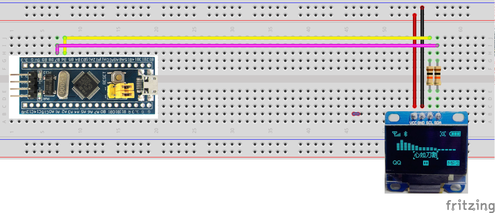

# Lesson 1: Using the OLED (1/25/17 - ?)
It is assumed that the user has the necessary environment set up. That is, for
their given OS the toolchains are set up correctly, the user is able to
communicate with the ST-Link device and Eclipse has been configured correctly.
If you need help ask someone for help in getting any of these set up. Also, it
is not absolutely necessary but you should have some experience with C/C++
programming language. If you do not there exist **many** online resources. Here
are some great ones:

- [Learn C](http://www.learn-c.org/)
- [Learn C++](http://www.learncpp.com/)

If you are struggling with a concept ask someone for help! And don't let anyone
tell you that learning C/C++ is "too hard"! 

## Wiring the OLED up
First we need to build our circuit to connect to the OLED. This is pretty
simple. Here is the circuit laid out in [Fritzing](http://fritzing.org/home/) (cool app by the way):

In case the image is hard to see, these are the connections that need to be made:

| STM32 | OLED  |
| :---: | :---: |
| B6    | SCK   |
| B7    | SDA   |
| VDD   | 3.3/5V |
| GND   | GND   |

The resistors used in the circuit are 1/4 Watt 10k Ohm resistors. These are
essential to the usage of the OLED. No resistors, no workie. If you need some
resistors ask for some.

## Flashing the STM32
Make sure you have brought down this repository's code base!!!  Ok, so for this
lesson we are going to play around with the OLED screen. The BUS that we will be
using to communicate with the screen is I2C (pronounced "I" Squared "C"). The
OLED is 128x64 pixels wide. You may have noticed that there is **a lot** of
unused code pertaininig to a different project ([Defcon
DarkNet](https://github.com/thedarknet/defcon24)). We are essentially going to
walk through their code and see what we can learn!!

The five files we will be editing/looking at are:
- src/main.cpp
- src/Badge/badge.cpp
- src/Badge/badge.h
- src/Badge/ssd1306.h
- src/Badge/ssd1306.cpp

The code as it is right now will display a familiar logo on the OLED and then
cycle through writing on to all of the pixels on the OLED and then write off to
all of the pixels. Very basic stuff. Other than that the altered code does
nothing special. 

**The screen gets turned on and initialized on line 93 of main.cpp**

**The screen enters the loop in `loopbadge` line 121 of main.cpp**

Much like the blinky program we flashed during last weeks' meeting, we must do
the same thing here. 
- Ensure that you ST-Link is hooked up correctly (ask for help if unsure),
  plugged into your computer and is supplying power to the STM32 board.
- Compile the project in Debug mode from the repository.
- Make sure there exists a .bin file under Debug/ directory in Eclipse
- Move your jumper on the board to the "1" position. Unfortunately these jumpers
  are not labelled, so if you want help ask.
- Press the reset button on STM32
- Click your external tools button that you set up from last weeks lesson.
- Tada!
